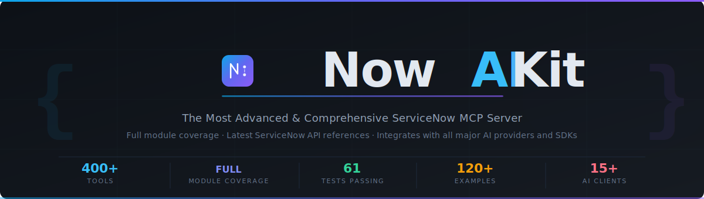

<div align="center">



<br/>

[](https://github.com/aartiq/nowaikit)
[](docs/TOOLS.md)
[](https://www.typescriptlang.org/)
[](LICENSE)
[](https://developer.servicenow.com)
[](https://modelcontextprotocol.io)
[](https://nodejs.org)

<br/>

# NowAIKit

## The Most Comprehensive ServiceNow AI Toolkit

> **400+ tools · 31+ ServiceNow modules · 5-minute setup · MIT licensed · Works with any AI**

**NowAIKit** is the most comprehensive, production-ready AI toolkit for ServiceNow — and the only one that truly does it all.

Connect **Claude**, **ChatGPT**, **Gemini**, **Cursor**, **GitHub Copilot**, or any MCP-compatible AI in under 5 minutes. Then let your AI read, build, deploy, and automate across every ServiceNow module — incidents, changes, scripts, flows, portals, integrations, HRSD, CSM, and more.

Ask in plain English. Deploy business rules from chat. Run ATF suites on demand. Query dev, staging, and prod simultaneously. Automate across multiple customer tenants without switching tabs. **Your AI, your instance, your rules.**

**Any AI. Any instance. Any scale. 100% open-source.**

> **Keywords:** ServiceNow MCP server · Model Context Protocol · ServiceNow AI · ITSM automation · ServiceNow Claude · ServiceNow ChatGPT · ServiceNow Cursor · ServiceNow Copilot · ServiceNow LLM · ServiceNow agent · MCP tools · ServiceNow API · agentic AI · ServiceNow developer tools

<br/>

| | |
|---|---|
| **Beginners** | Zero ServiceNow API knowledge needed. Connect in 5 minutes. Ask in plain English. Free PDI at developer.servicenow.com. |
| **Developers** | Write, deploy, test, and manage scripts, flows, widgets, and integrations at AI speed — 10x faster. |
| **Architects & MSPs** | Orchestrate multi-step autonomous workflows. Compare environments. Manage multiple customer tenants in one session. |

<br/>

</div>

---

## Who Is This For?

<table>
<tr>
<td width="33%" valign="top">

### Beginners
**Zero ServiceNow API knowledge required.**

Connect Claude Desktop or Cursor to your free PDI in 5 minutes. Ask questions in plain English, browse incidents, search KB articles, place catalog orders, monitor SLAs — all from your AI chat window. No code. No Postman. No documentation diving. Just ask.

*Start here → [5-Minute Quickstart](#getting-started)*

</td>
<td width="33%" valign="top">

### Developers
**10x faster with AI as your development partner.**

Write business rules, deploy client scripts, manage UI Policies and ACLs, create Service Portal widgets, configure REST Messages, manage Transform Maps, and update changesets — all in plain English. Full TypeScript types, ATF integration, and role-based packages built in.

*Explore → [Platform Developer Package](#role-based-tool-packages)*

</td>
<td width="33%" valign="top">

### Architects, Admins & MSPs
**Autonomous workflows. Multi-instance. Multi-customer.**

Trigger Agentic Playbooks, orchestrate multi-step ITSM/HRSD/CSM processes, compare environments side by side, manage dozens of customer tenants in one session, and run full data quality audits — at AI speed, across your entire ServiceNow estate.

*Deep dive → [Now Assist & Agentic Guide](docs/NOW_ASSIST.md)*

</td>
</tr>
</table>

---

## Why NowAIKit

<table>
<tr>
<td width="33%" valign="top">

### Fully Autonomous AI Operations

Your AI doesn't just answer questions — it *acts*. Create incidents, write and deploy scripts, trigger flows, fire events, upload attachments, manage changesets, and run full ATF suites — end-to-end, without manual steps. Native Now Assist Agentic Playbook support for next-generation ServiceNow AI automation.

</td>
<td width="33%" valign="top">

### Works With Every AI, Out of the Box

**Claude, ChatGPT, Gemini, Grok, Cursor, Windsurf, GitHub Copilot, Amazon Q, JetBrains, Continue.dev, Cline, Zed, Google AI Studio, Ollama** — all supported out of the box. Any MCP-compatible client. Any custom Python or TypeScript agent. One toolkit, every AI platform, zero lock-in.

</td>
<td width="33%" valign="top">

### Unmatched Platform Coverage

**400+ production-ready tools** across every ServiceNow domain — ITSM, ITOM, HRSD, CSM, SecOps, GRC, Agile, ATF, Flow Designer, Scripting, Now Assist, Service Portal, Integration Hub, Performance Analytics, System Properties, Update Sets, Virtual Agent, ITAM, DevOps, Machine Learning, Workspace/UIB, Mobile, and Deployment. Nothing else comes close.

</td>
</tr>
<tr>
<td width="33%" valign="top">

### Role-Based Tool Intelligence

Fourteen pre-built persona packages — service desk, platform developer, portal developer, integration engineer, ITOM engineer, AI developer, ITAM analyst, DevOps engineer, and more. Each exposes exactly the right tools for that role. Reduce noise, enforce least-privilege, and configure once per team.

</td>
<td width="33%" valign="top">

### Safe by Default, Powerful When Needed

A five-tier permission model keeps your instance protected. **Read is always on.** Write, CMDB, Scripting, Now Assist, and ATF capabilities each require an explicit opt-in flag. No AI can accidentally modify your production data. Scale permissions as your confidence grows — without touching code.

</td>
<td width="33%" valign="top">

### True Multi-Instance & Multi-Customer

Connect to **unlimited ServiceNow instances** from one session — dev, staging, prod, *and* multiple customer tenants simultaneously. Pass `instance: "acme_prod"` on any tool call, or `switch_instance` globally. MSPs, consultants, and enterprise teams can compare, query, and automate across every environment at once. No other ServiceNow AI toolkit does this.

</td>
</tr>
</table>

---

## Quick Links

| Resource | Link |
|----------|------|
| All Tools Reference | [docs/TOOLS.md](docs/TOOLS.md) |
| Client Setup (All AI tools, beginner + advanced) | [docs/CLIENT_SETUP.md](docs/CLIENT_SETUP.md) |
| Role-Based Tool Packages | [docs/TOOL_PACKAGES.md](docs/TOOL_PACKAGES.md) |
| Now Assist & AI Integration | [docs/NOW_ASSIST.md](docs/NOW_ASSIST.md) |
| ATF Testing Guide | [docs/ATF.md](docs/ATF.md) |
| Scripting Management | [docs/SCRIPTING.md](docs/SCRIPTING.md) |
| Reporting & Analytics | [docs/REPORTING.md](docs/REPORTING.md) |
| Multi-Instance Setup | [docs/MULTI_INSTANCE.md](docs/MULTI_INSTANCE.md) |
| 120+ Real-World Examples | [EXAMPLES.md](EXAMPLES.md) |
| Changelog | [CHANGELOG.md](CHANGELOG.md) |

---

## Module Coverage

Domain modules covering the full ServiceNow platform:

| Module | Key Capabilities |
|--------|-----------------|
| Core & CMDB | Record query, schema discovery, CMDB CIs, ITOM Discovery, MID Servers, multi-instance management |
| Incident Management | Create, update, resolve, close, work notes, comments |
| Problem Management | Problem records, root cause analysis, known errors |
| Change Management | Create, get, update, submit for approval, close change requests |
| Task Management | Generic tasks, my-task lists, completions |
| Knowledge Base | Search, create, update, publish KB articles |
| Service Catalog & Approvals | Catalog browsing, create/update items, order items, SLA tracking, approval workflows, approval rules |
| User & Group Management | Users, groups, membership, role assignments |
| Reporting & Analytics | Aggregate queries, trend analysis, create/update reports, scheduled job CRUD, run history |
| ATF Testing | Test suites, test execution, ATF Failure Insight |
| Now Assist / AI | NLQ, AI Search, summaries, resolution suggestions, Agentic Playbooks |
| Scripting | Business rules, script includes, client script CRUD, UI Policies, UI Actions, ACL management, changesets |
| Agile / Scrum | Stories, epics, sprints, scrum tasks |
| HR Service Delivery (HRSD) | HR cases, HR services, employee profiles, onboarding/offboarding |
| Customer Service Management (CSM) | Customer cases, accounts, contacts, products, SLAs |
| Security Operations & GRC | SecOps incidents, vulnerabilities, GRC risks, controls, threat intel |
| Flow Designer & Process Automation | Flows, subflows, triggers, executions, Process Automation playbooks |
| Service Portal & UI Builder | Create/list portals & pages, widgets (create/update/deploy), Next Experience apps/pages, themes |
| Integration Hub | REST Messages, Transform Maps, Import Sets, Event Registry, OAuth apps, credential aliases |
| Notifications & Attachments | Email notifications, email logs, file attachments (upload/list/delete), templates, subscriptions |
| Performance Analytics | PA indicators/scorecards, time-series, create/update dashboards, PA jobs, data quality checks |
| System Properties | Get, set, bulk operations, validate, export/import, audit history |
| Update Set Management | Create, switch, preview, complete, export, auto-ensure active set |
| Virtual Agent (VA) | Topic authoring, conversation history, categories, topic listing |
| IT Asset Management (ITAM) | Assets, software licenses, contracts, compliance reporting |
| DevOps & Pipeline Tracking | Pipelines, deployments, change governance, DORA metrics |
| Scoped Applications (App Studio) | List, get, create, and update scoped application records |

---

## Authentication

Two authentication methods are supported:

| Method | Best For |
|--------|----------|
| **Basic Auth** | Development, personal instances, quick setup |
| **OAuth 2.0** (client credentials / password grant) | Production deployments, service accounts |

SSO / OIDC authentication (Okta, Azure AD / Entra, Ping Identity) is available in the Enterprise edition — see [nowaikit.com/#pricing](https://nowaikit.com/#pricing).

For OAuth setup in ServiceNow, see [docs/SERVICENOW_OAUTH_SETUP.md](docs/SERVICENOW_OAUTH_SETUP.md).

---

## Permission System

A four-tier permission model keeps your instance safe by default:

| Tier | Environment Variable | Covers |
|------|---------------------|--------|
| 0 — Read | *(always on)* | All query and read operations |
| 1 — Write | `WRITE_ENABLED=true` | Create/update across ITSM, HRSD, CSM, Agile |
| 2 — CMDB Write | `CMDB_WRITE_ENABLED=true` | CI create/update in the CMDB |
| 3 — Scripting | `SCRIPTING_ENABLED=true` | Business rules, script includes, changesets |
| 4 — Now Assist | `NOW_ASSIST_ENABLED=true` | AI Agentic Playbooks, NLQ, AI Search |

---

## Role-Based Tool Packages

Set `MCP_TOOL_PACKAGE` to expose only the tools relevant to each persona:

| Package | Persona | Tools Included |
|---------|---------|---------------|
| `full` | Administrators | All tools (400+) |
| `service_desk` | L1/L2 Agents | Incidents, tasks, approvals, KB, SLA |
| `change_coordinator` | Change Managers | Changes (create/approve/close), CAB, CMDB, approvals |
| `knowledge_author` | KB Authors | Knowledge base create/publish |
| `catalog_builder` | Catalog Admins | Catalog, users, groups |
| `system_administrator` | Sys Admins | Users, groups, reports, logs, notifications, attachments, ACLs, PA |
| `platform_developer` | Developers | Scripts, UI Policies, UI Actions, ACLs, client scripts, ATF, changesets |
| `portal_developer` | Portal/UX Devs | Portals, pages, widgets (create/update), UI Policies, UI Actions, client scripts |
| `integration_engineer` | Integration Devs | REST Messages, Transform Maps, Import Sets, Events, OAuth, credentials |
| `itom_engineer` | ITOM Engineers | CMDB, Discovery, MID servers, events |
| `agile_manager` | Scrum Masters | Stories, epics, sprints |
| `ai_developer` | AI Builders | Now Assist, NLQ, Agentic Playbooks |

---

## Getting Started

### Option A — Interactive Setup Wizard (Recommended)

```bash
# Install globally (Node.js 20+ required)
npm install -g nowaikit

# Run the wizard — detects your AI clients and writes config automatically
npx nowaikit setup
```

The wizard will:
1. Ask for your ServiceNow instance URL + credentials
2. Test the connection
3. Let you pick a tool package and permission level
4. Detect Claude Desktop, Cursor, VS Code, Windsurf, Continue.dev, Claude Code on your machine
5. Write the config directly — no copy-paste, no manual JSON editing

```
# Add a second instance later
nowaikit setup --add

# Manage instances
nowaikit instances list
```

### Option B — Web Dashboard (one command)

```bash
npx nowaikit web
```

Opens the NowAIKit dashboard at **http://localhost:4175** — includes instance management, settings, and an audit log viewer.

```bash
# Custom port
npx nowaikit web --port 3000

# Expose to network (use with caution)
npx nowaikit web --host 0.0.0.0

# Don't auto-open browser
npx nowaikit web --no-open
```

### Option C — Desktop App

Download the native desktop app (macOS, Windows, Linux) from [GitHub Releases](https://github.com/aartiq/nowaikit/releases). Includes a visual setup wizard, tool browser, and audit log viewer.

### Option D — Manual Setup

```bash
git clone https://github.com/aartiq/nowaikit.git && cd nowaikit
npm install && npm run build
cp .env.example .env   # fill in your ServiceNow credentials
```

Then point your AI client at `dist/server.js` — see [Supported AI Clients](#supported-ai-clients) below.

> **No ServiceNow instance?** Get a free Personal Developer Instance at [developer.servicenow.com](https://developer.servicenow.com) — ready in minutes.

**Full installation guide → [docs/INSTALLATION.md](docs/INSTALLATION.md)**

---

## Client Setup Guides

Step-by-step setup for every major AI client — Claude Desktop, Claude Code, Cursor, VS Code, Windsurf, Zed, GitHub Copilot, Continue.dev, Cline, JetBrains, Amazon Q, Google AI Studio, ChatGPT, Grok, Ollama, and more.

**Full guide → [docs/CLIENT_SETUP.md](docs/CLIENT_SETUP.md)**

For quick setup snippets, see the [Supported AI Clients](#supported-ai-clients) section below.
---

## Example Interactions

Once connected, ask your AI assistant in plain language:

**ITSM & Change Management:**
```
Show me all open P1 incidents assigned to the Network Operations group.
```
```
Create a normal change request for deploying the new API gateway — implementation planned for Saturday midnight.
```
```
What CMDB CIs does the ERP application depend on?
```

**Scripting & Development:**
```
List all client scripts on the incident table and show me the ones that fire on form load.
```
```
Create a UI action button "Escalate to L3" on the incident form that assigns the ticket to the L3-Support group.
```
```
Show me all ACL rules for the change_request table that restrict the "delete" operation.
```

**Service Portal & UI Builder:**
```
List all widgets in the Service Portal that contain "catalog" in their name.
```
```
Get the full source code of the "Stock Ticker" widget so I can update its server script.
```
```
Create a new portal widget called "My Approvals Widget" with a simple Angular template that lists pending approvals.
```

**Integrations & Events:**
```
List all REST Message definitions that connect to external APIs.
```
```
Show me all transform maps that target the incident table.
```
```
Fire the custom event "myapp.ticket.escalated" on incident INC0012345.
```

**Notifications & Attachments:**
```
List all email notifications that trigger on the incident table when a comment is added.
```
```
Upload a screenshot of the error (base64) as an attachment to incident INC0012345.
```
```
Show me all failed email log entries from the last 24 hours.
```

**Performance Analytics & Data Quality:**
```
Get the current scorecard for the "Mean Time to Resolve" PA indicator with a 30-day trend.
```
```
Check the data completeness of the incident table — how many incidents are missing assignment_group or category?
```
```
Compare record counts across incident, change_request, and problem tables.
```

**ATF, Reporting & Scheduled Jobs:**
```
Run the Regression Test Suite and show me any failures with ATF Failure Insight details.
```
```
Summarise the last 30 days of incident trends by category.
```
```
Create a scheduled job that runs daily at 3am to archive closed incidents older than 90 days.
```

For 120+ real-world examples with inputs, outputs, and advanced workflows, see [EXAMPLES.md](EXAMPLES.md).

---

## Slash Commands & @ Mentions

Once connected, type `/` in Claude Desktop or Cursor to see built-in ServiceNow shortcuts:

| Command | What it does |
|---------|-------------|
| `/morning-standup` | P1/P2 open incidents, changes due today, SLA breaches |
| `/my-tickets` | All open tasks/incidents assigned to you |
| `/p1-alerts` | Active P1 incidents with time-open and assignee |
| `/my-changes` | Your pending change requests and approval status |
| `/create-incident` | Guided incident creation |
| `/sla-breaches` | Records currently breaching SLA |
| `/ci-health` | CMDB CI health check |
| `/run-atf` | Trigger ATF test suite |
| `/switch-instance` | Interactive instance picker |
| `/knowledge-search` | Search KB articles |
| `/deploy-updateset` | Guided update set commit |

Type `@` to pull live ServiceNow data into your AI context:

| Mention | Returns |
|---------|---------|
| `@my-incidents` | Your open incidents |
| `@open-changes` | Pending change requests |
| `@sla-breaches` | Records breaching SLA now |
| `@instance:info` | Current instance metadata |
| `@ci:<name>` | CMDB CI by name |
| `@kb:<title>` | Knowledge article by title |

Add your own commands in `nowaikit.commands.json`:

```json
[
  {
    "name": "my-p1-runbook",
    "description": "P1 runbook for my team",
    "template": "List all P1 incidents in the Network category. For each: number, description, assignee, time open. Flag SLA breaches."
  }
]
```

## Advanced Configuration

| Topic | Guide |
|-------|-------|
| OAuth 2.0 setup (ServiceNow OAuth app creation) | [docs/SERVICENOW_OAUTH_SETUP.md](docs/SERVICENOW_OAUTH_SETUP.md) |
| Multi-instance / multi-customer (dev, staging, prod, tenants) | [docs/MULTI_INSTANCE.md](docs/MULTI_INSTANCE.md) |
| Role-based tool packages | [docs/TOOL_PACKAGES.md](docs/TOOL_PACKAGES.md) |
| All environment variables reference | [docs/INSTALLATION.md](docs/INSTALLATION.md) |

### Pro / Enterprise Features

The following features are available in **NowAIKit Pro** and **Enterprise** editions:

| Feature | Edition |
|---------|---------|
| HTTP API server & web dashboard | Pro |
| Desktop app (macOS, Windows, Linux) | Pro |
| SSO / OIDC (Okta, Azure AD / Entra, Ping Identity) | Enterprise |
| Audit logging (JSONL + SIEM webhooks) | Enterprise |
| Org policy governance (MDM / GPO deployment) | Enterprise |

Learn more at [nowaikit.com/#pricing](https://nowaikit.com/#pricing).

---

## See It In Action

These are real interactions you can have with your AI once NowAIKit is connected:

**Operations — plain English:**
```
You: "Show me all P1 incidents opened this week that are still unresolved"
You: "Which assignment groups have the most open incidents right now?"
You: "Find all change requests scheduled for this weekend"
You: "Is any SLA about to breach in the next 2 hours?"
```

**Development — AI writes and deploys for you:**
```
You: "Create a business rule that auto-assigns high-priority incidents to the NOC group"
You: "Write a client script that validates email format on the contact form"
You: "Create a Service Portal widget that shows my team's open tasks"
You: "Set up a REST Message integration to send alerts to our Slack channel"
```

**AI-powered intelligence:**
```
You: "Summarise this incident and suggest a resolution based on similar past cases"
You: "Use Predictive Intelligence to categorise this new incident description"
You: "Trigger the SOC Agentic Playbook for this security incident"
You: "What's the trend in P2 incidents over the last 6 months?"
```

**Advanced automation:**
```
You: "Compare record counts between prod and dev for the incident table"
You: "Check data completeness on the cmdb_ci_server table — which fields are mostly empty?"
You: "Run the nightly sync transform map on the latest import set"
You: "Create a scheduled job that emails the on-call team daily at 7am"
```

**Multi-instance & multi-customer:**
```
You: "List all configured instances"
You: "Switch to customer_acme and show me their open P1 incidents"
You: "Compare open change counts between prod and staging"
You: "Get SLA breach risk from customer_globex prod instance"
```

See [EXAMPLES.md](EXAMPLES.md) for 120+ real-world examples across all ServiceNow modules.

---

## Supported AI Clients

**Any MCP-compatible AI works.** NowAIKit has been tested with every major AI assistant, editor, and agent framework. Pick yours and follow the 3-step setup below.

### AI Assistants & Chat

<details>
<summary><b>Claude Desktop</b> — Anthropic (Mac / Windows / Linux)</summary>

1. Install Claude Desktop from [claude.ai/download](https://claude.ai/download)
2. Edit config:
   - **macOS**: `~/Library/Application Support/Claude/claude_desktop_config.json`
   - **Windows**: `%APPDATA%\Claude\claude_desktop_config.json`
3. Add this block — **single instance** (replace path and credentials):

```json
{
  "mcpServers": {
    "nowaikit": {
      "command": "node",
      "args": ["/absolute/path/to/nowaikit/dist/server.js"],
      "env": {
        "SERVICENOW_INSTANCE_URL": "https://yourinstance.service-now.com",
        "SERVICENOW_AUTH_METHOD": "basic",
        "SERVICENOW_BASIC_USERNAME": "admin",
        "SERVICENOW_BASIC_PASSWORD": "your_password",
        "WRITE_ENABLED": "false"
      }
    }
  }
}
```

Or use **multi-instance** (dev + staging + prod, or multiple customer tenants):

```json
{
  "mcpServers": {
    "nowaikit": {
      "command": "node",
      "args": ["/absolute/path/to/nowaikit/dist/server.js"],
      "env": {
        "SN_INSTANCES_CONFIG": "/absolute/path/to/instances.json"
      }
    }
  }
}
```

Copy `instances.example.json` → `instances.json`, fill in your instances, then ask:
> *"List instances"* → *"Switch to prod"* → *"Show me all P1 incidents"*
> *"Get open changes from customer_acme"* (uses `instance` parameter per-call)

4. Restart Claude Desktop. The hammer icon confirms connection.

Full guide → [clients/claude-desktop/SETUP.md](clients/claude-desktop/SETUP.md) | [docs/MULTI_INSTANCE.md](docs/MULTI_INSTANCE.md)
</details>

<details>
<summary><b>ChatGPT / OpenAI</b> (API)</summary>

OpenAI supports MCP via the **Responses API** (`mcp` tool type) in the latest SDK (v1.50+):

```python
from openai import OpenAI
import os, subprocess

# Start NowAIKit as a subprocess MCP server
proc = subprocess.Popen(
    ["node", "/path/to/nowaikit/dist/server.js"],
    stdin=subprocess.PIPE, stdout=subprocess.PIPE, stderr=subprocess.PIPE,
    env={**os.environ,
         "SERVICENOW_INSTANCE_URL": "https://yourinstance.service-now.com",
         "SERVICENOW_AUTH_METHOD": "basic",
         "SERVICENOW_BASIC_USERNAME": "admin",
         "SERVICENOW_BASIC_PASSWORD": "your_password"}
)

client = OpenAI()
# Use with Responses API tool type "mcp" or via function calling
response = client.responses.create(
    model="gpt-4o",
    tools=[{"type": "mcp", "server_label": "nowaikit"}],
    input="Show me all open P1 incidents"
)
```

Full guide → [docs/CLIENT_SETUP.md](docs/CLIENT_SETUP.md)
</details>

<details>
<summary><b>Google Gemini / Vertex AI</b> (API)</summary>

1. Install NowAIKit: `npm install -g nowaikit`
2. Use the Python client in `clients/gemini/`:

```bash
pip install google-generativeai
python clients/gemini/servicenow_gemini_client.py
```

Full guide → [clients/gemini/SETUP.md](clients/gemini/SETUP.md)
</details>

<details>
<summary><b>Google AI Studio</b> — Gemini 2.5 Flash / Pro / Gemini 3 (MCP Preview)</summary>

Google AI Studio supports MCP servers via its agent execution environment (currently in preview).

1. Go to [aistudio.google.com](https://aistudio.google.com) and open **Build → Agent**
2. In the **Tools** panel, add an MCP Server and point it to your NowAIKit instance:

```json
{
  "name": "nowaikit",
  "transport": "stdio",
  "command": "node",
  "args": ["/absolute/path/to/nowaikit/dist/server.js"],
  "env": {
    "SERVICENOW_INSTANCE_URL": "https://yourinstance.service-now.com",
    "SERVICENOW_AUTH_METHOD": "basic",
    "SERVICENOW_BASIC_USERNAME": "admin",
    "SERVICENOW_BASIC_PASSWORD": "your_password",
    "WRITE_ENABLED": "false"
  }
}
```

3. Alternatively, use the **Gemini API** directly with function calling by mapping NowAIKit tool definitions:

```python
import google.generativeai as genai
import subprocess, json, os

# Start NowAIKit MCP server
proc = subprocess.Popen(
    ["node", "/path/to/nowaikit/dist/server.js"],
    stdin=subprocess.PIPE, stdout=subprocess.PIPE, stderr=subprocess.PIPE,
    env={**os.environ,
         "SERVICENOW_INSTANCE_URL": "https://yourinstance.service-now.com",
         "SERVICENOW_AUTH_METHOD": "basic",
         "SERVICENOW_BASIC_USERNAME": "admin",
         "SERVICENOW_BASIC_PASSWORD": "your_password"}
)

genai.configure(api_key=os.environ["GOOGLE_API_KEY"])
model = genai.GenerativeModel("gemini-3.1-pro")  # or gemini-3-flash, gemini-2.5-flash
# Use model.generate_content() with tools= mapped from NowAIKit definitions
```

Full guide → [docs/CLIENT_SETUP.md](docs/CLIENT_SETUP.md)
</details>

<details>
<summary><b>Grok (xAI)</b> — via OpenAI-compatible API</summary>

1. Grok uses the OpenAI-compatible API format. Follow the OpenAI setup above
2. Set `base_url="https://api.x.ai/v1"` and your `XAI_API_KEY`

Full guide → [docs/CLIENT_SETUP.md](docs/CLIENT_SETUP.md)
</details>

---

### AI Code Editors

<details>
<summary><b>Cursor</b> — AI-first code editor</summary>

1. Open Cursor → Settings → MCP
2. Add server config:

```json
{
  "mcpServers": {
    "nowaikit": {
      "command": "node",
      "args": ["/absolute/path/to/nowaikit/dist/server.js"],
      "env": {
        "SERVICENOW_INSTANCE_URL": "https://yourinstance.service-now.com",
        "SERVICENOW_AUTH_METHOD": "basic",
        "SERVICENOW_BASIC_USERNAME": "admin",
        "SERVICENOW_BASIC_PASSWORD": "your_password",
        "WRITE_ENABLED": "true",
        "SCRIPTING_ENABLED": "true"
      }
    }
  }
}
```
3. Restart Cursor. Ask in Chat: *"List all open P1 incidents"*

**Multi-instance:** Replace the env block with `"SN_INSTANCES_CONFIG": "/path/to/instances.json"` to connect to multiple tenants.

Full guide → [clients/cursor/SETUP.md](clients/cursor/SETUP.md)
</details>

<details>
<summary><b>Windsurf (Codeium)</b> — AI-native editor</summary>

1. Open Windsurf → Cascade → Configure MCP
2. Add the same JSON block as Cursor above
3. Reload Windsurf window

Full guide → [docs/CLIENT_SETUP.md](docs/CLIENT_SETUP.md)
</details>

<details>
<summary><b>Zed Editor</b> — collaborative AI editor</summary>

1. Open Zed → `~/.config/zed/settings.json`
2. Add under `"context_servers"`:

```json
{
  "context_servers": {
    "nowaikit": {
      "command": { "path": "node", "args": ["/path/to/nowaikit/dist/server.js"] },
      "settings": {
        "SERVICENOW_INSTANCE_URL": "https://yourinstance.service-now.com",
        "SERVICENOW_AUTH_METHOD": "basic",
        "SERVICENOW_BASIC_USERNAME": "admin",
        "SERVICENOW_BASIC_PASSWORD": "your_password"
      }
    }
  }
}
```

Full guide → [docs/CLIENT_SETUP.md](docs/CLIENT_SETUP.md)
</details>

---

### IDE Extensions

<details>
<summary><b>VS Code</b> — Native MCP (v1.99+, no subscription required)</summary>

VS Code 1.99 and later includes built-in MCP support — no extension or subscription required.

1. Install [VS Code 1.99+](https://code.visualstudio.com/download)
2. Create `.vscode/mcp.json` in your workspace (or edit User settings):

```json
{
  "servers": {
    "nowaikit": {
      "type": "stdio",
      "command": "node",
      "args": ["/absolute/path/to/nowaikit/dist/server.js"],
      "env": {
        "SERVICENOW_INSTANCE_URL": "https://yourinstance.service-now.com",
        "SERVICENOW_AUTH_METHOD": "basic",
        "SERVICENOW_BASIC_USERNAME": "admin",
        "SERVICENOW_BASIC_PASSWORD": "your_password",
        "WRITE_ENABLED": "true",
        "SCRIPTING_ENABLED": "true"
      }
    }
  }
}
```

3. Open the Command Palette (`Cmd/Ctrl+Shift+P`) → **MCP: List Servers** to verify the connection
4. Open Copilot Chat (or any AI assistant in VS Code) and use `@nowaikit` or just ask naturally

> **Tip:** Add `.vscode/mcp.json` to `.gitignore` if it contains credentials, or use environment variables from a `.env` file.

Full guide → [clients/vscode/SETUP.md](clients/vscode/SETUP.md)
</details>

<details>
<summary><b>VS Code — GitHub Copilot</b> (agent mode)</summary>

1. Install VS Code + GitHub Copilot extension
2. Create `.vscode/mcp.json` in your project:

```json
{
  "servers": {
    "nowaikit": {
      "type": "stdio",
      "command": "node",
      "args": ["${workspaceFolder}/../../nowaikit/dist/server.js"],
      "env": {
        "SERVICENOW_INSTANCE_URL": "https://yourinstance.service-now.com",
        "SERVICENOW_AUTH_METHOD": "basic",
        "SERVICENOW_BASIC_USERNAME": "admin",
        "SERVICENOW_BASIC_PASSWORD": "your_password"
      }
    }
  }
}
```
3. Open Copilot Chat → Agent mode → `@nowaikit`

Full guide → [clients/vscode/SETUP.md](clients/vscode/SETUP.md)
</details>

<details>
<summary><b>VS Code — Continue.dev</b> (open-source Copilot alternative)</summary>

1. Install [Continue](https://marketplace.visualstudio.com/items?itemName=Continue.continue) from VS Code Marketplace
2. Edit `~/.continue/config.json`:

```json
{
  "mcpServers": [
    {
      "name": "nowaikit",
      "command": "node",
      "args": ["/path/to/nowaikit/dist/server.js"],
      "env": {
        "SERVICENOW_INSTANCE_URL": "https://yourinstance.service-now.com",
        "SERVICENOW_AUTH_METHOD": "basic",
        "SERVICENOW_BASIC_USERNAME": "admin",
        "SERVICENOW_BASIC_PASSWORD": "your_password"
      }
    }
  ]
}
```

Full guide → [docs/CLIENT_SETUP.md](docs/CLIENT_SETUP.md)
</details>

<details>
<summary><b>VS Code — Cline</b> (autonomous AI agent)</summary>

1. Install [Cline](https://marketplace.visualstudio.com/items?itemName=saoudrizwan.claude-dev) from VS Code Marketplace
2. Open Cline → MCP Servers → Add Server
3. Enter the path to `nowaikit/dist/server.js` and your environment variables

Full guide → [docs/CLIENT_SETUP.md](docs/CLIENT_SETUP.md)
</details>

<details>
<summary><b>JetBrains AI Assistant</b> (IntelliJ IDEA, PyCharm, WebStorm, etc.)</summary>

1. Install JetBrains AI Assistant plugin
2. Go to Settings → Tools → AI Assistant → MCP Servers
3. Add a new server with the path to `nowaikit/dist/server.js`
4. Set environment variables in the server configuration dialog

Full guide → [docs/CLIENT_SETUP.md](docs/CLIENT_SETUP.md)
</details>

<details>
<summary><b>Amazon Q Developer</b> (AWS CLI + IDE)</summary>

1. Install Amazon Q Developer extension for VS Code or IntelliJ
2. Configure MCP via `~/.aws/amazonq/mcp.json`:

```json
{
  "mcpServers": {
    "nowaikit": {
      "command": "node",
      "args": ["/path/to/nowaikit/dist/server.js"],
      "env": {
        "SERVICENOW_INSTANCE_URL": "https://yourinstance.service-now.com",
        "SERVICENOW_AUTH_METHOD": "basic",
        "SERVICENOW_BASIC_USERNAME": "admin",
        "SERVICENOW_BASIC_PASSWORD": "your_password"
      }
    }
  }
}
```

Full guide → [docs/CLIENT_SETUP.md](docs/CLIENT_SETUP.md)
</details>

---

### CLI & Terminal Agents

<details>
<summary><b>Claude Code / Claude CLI</b> — Anthropic's official CLI</summary>

```bash
# Install Claude Code
npm install -g @anthropic-ai/claude-code

# Register NowAIKit as an MCP server
claude mcp add nowaikit node /absolute/path/to/nowaikit/dist/server.js \
  --env SERVICENOW_INSTANCE_URL=https://yourinstance.service-now.com \
  --env SERVICENOW_AUTH_METHOD=basic \
  --env SERVICENOW_BASIC_USERNAME=admin \
  --env SERVICENOW_BASIC_PASSWORD=your_password

# Verify
claude mcp list

# Use it
claude "Show me all unresolved P1 incidents"
```

Full guide → [clients/claude-code/SETUP.md](clients/claude-code/SETUP.md)
</details>

<details>
<summary><b>Ollama</b> — run AI locally (Llama, Mistral, Phi, etc.)</summary>

1. Install [Ollama](https://ollama.ai) and pull a model: `ollama pull llama3`
2. Use an MCP-compatible client (e.g. Cline or Continue) configured to use Ollama as the model
3. Point the MCP server at `nowaikit/dist/server.js`

Full guide → [docs/CLIENT_SETUP.md](docs/CLIENT_SETUP.md)
</details>

---

### Programmatic / Agent SDK

<details>
<summary><b>OpenAI Codex / Custom Python Agent</b></summary>

```bash
cd clients/codex
pip install -r requirements.txt
cp .env.basic.example .env  # fill in your credentials
python servicenow_openai_client.py
```

Full guide → [clients/codex/SETUP.md](clients/codex/SETUP.md)
</details>

<details>
<summary><b>Anthropic Agent SDK (Claude API)</b></summary>

```python
import anthropic, subprocess, json

# Start NowAIKit subprocess
proc = subprocess.Popen(
    ["node", "/path/to/nowaikit/dist/server.js"],
    stdin=subprocess.PIPE, stdout=subprocess.PIPE,
    env={**os.environ,
         "SERVICENOW_INSTANCE_URL": "https://yourinstance.service-now.com",
         "SERVICENOW_AUTH_METHOD": "basic",
         "SERVICENOW_BASIC_USERNAME": "admin",
         "SERVICENOW_BASIC_PASSWORD": "your_password"}
)
# Then use with the Anthropic MCP client SDK
```

See [Anthropic MCP Python SDK](https://github.com/modelcontextprotocol/python-sdk) for full integration.
</details>

---

### Quick Reference

| Client | Type | Auth | Guide |
|--------|------|------|-------|
| Claude Desktop | Desktop app | Basic, OAuth | [Setup](clients/claude-desktop/SETUP.md) |
| Claude Code CLI | Terminal | Basic, OAuth | [Setup](clients/claude-code/SETUP.md) |
| Cursor | AI editor | Basic, OAuth | [Setup](clients/cursor/SETUP.md) |
| Windsurf | AI editor | Basic, OAuth | [Setup](docs/CLIENT_SETUP.md) |
| Zed | AI editor | Basic, OAuth | [Setup](docs/CLIENT_SETUP.md) |
| **VS Code** (Native MCP 1.99+) | IDE | Basic, OAuth | [Setup](clients/vscode/SETUP.md) |
| VS Code + GitHub Copilot | IDE | Basic, OAuth | [Setup](clients/vscode/SETUP.md) |
| VS Code + Continue.dev | IDE | Basic, OAuth | [Setup](docs/CLIENT_SETUP.md) |
| VS Code + Cline | IDE | Basic, OAuth | [Setup](docs/CLIENT_SETUP.md) |
| JetBrains AI | IDE | Basic, OAuth | [Setup](docs/CLIENT_SETUP.md) |
| Amazon Q Developer | IDE / CLI | Basic, OAuth | [Setup](docs/CLIENT_SETUP.md) |
| ChatGPT / OpenAI | API | Basic, OAuth | [Setup](clients/codex/SETUP.md) |
| **Google AI Studio** | API / Agent | Basic, OAuth | [Setup](docs/CLIENT_SETUP.md) |
| Google Gemini API | API | Basic, OAuth | [Setup](clients/gemini/SETUP.md) |
| Grok (xAI) | API | Basic, OAuth | [Setup](docs/CLIENT_SETUP.md) |
| Ollama (local) | Local | Basic | [Setup](docs/CLIENT_SETUP.md) |
| Anthropic Agent SDK | Python | Basic, OAuth | [Setup](docs/CLIENT_SETUP.md) |

---

## What's New in v2.5

### Multi-provider AI chat in the Desktop app & Web Dashboard

The nowaikit Desktop and Web Dashboard support **5 AI providers** side-by-side — with full agentic tool-use for all providers. All model lists are kept current with each provider's latest releases.

- **Provider switcher** — one-click toggle between providers in the Chat header; per-provider model dropdown updates automatically
- **Claude (Anthropic)** — Opus 4.6 · Sonnet 4.6 · Haiku 4.5
- **ChatGPT / OpenAI** — GPT-5.2 · GPT-5.2 Pro · GPT-5.1 · GPT-5 mini · GPT-5 nano · GPT-4.1 · GPT-4o · o3 · o4 mini
- **Gemini (Google AI)** — Gemini 3.1 Pro · Gemini 3 Pro · Gemini 3 Flash · 2.5 Pro · 2.5 Flash · 2.5 Flash Lite
- **Groq (free)** — Llama 4 Maverick · Llama 4 Scout · Llama 3.3 70B · Llama 3.1 8B — ultra-fast inference, no credit card required
- **OpenRouter (200+ models)** — unified gateway to OpenAI o1 Pro · xAI Grok 4 · Claude Opus 4.6 · Gemini 2.5 Flash · DeepSeek R1 · Llama 4 Maverick · and more — many free tiers available
- **o3/o4 reasoning model support** — automatic detection skips system messages and switches to `max_completion_tokens`; tools not sent to models that don't support them

### In-app provider sign-in

Settings → AI Providers now shows a unified **"Sign in to {Provider}"** flow per provider:

1. Click **Sign in to Claude / ChatGPT / Gemini / Groq / OpenRouter** — the provider's API key portal opens in your system browser
2. Sign in to your account and create/copy an API key
3. Paste it directly into the focused input that appears
4. Click **Verify Key** — a lightweight validation call confirms the key is valid before you save

Each provider panel shows a clear **subscription note** explaining that API access is separate from consumer subscriptions (Claude.ai Pro, ChatGPT Plus, Gemini Advanced). Groq and OpenRouter offer generous free tiers — no credit card required.

### Slash-command tool picker in Chat

Type `/` in the chat input to open a floating picker over all 400+ ServiceNow tools:

- Filter by tool name or description as you type
- `↑` / `↓` to navigate · **Tab** or **Enter** to select · **Esc** to close
- Inserts `/toolname` into your message — the AI knows to invoke that specific tool

### Other Desktop improvements

- **Test Key button** — inline on the API key input; calls the provider's model-list endpoint to validate without sending a chat message
- **Server health auto-recovery** — polls every 8 seconds; "offline" status recovers automatically without restarting the app
- **Dashboard URL truncation** — long instance URLs are truncated with `…` (full URL on hover)
- **Bug fix: ChatGPT and Gemini responses now display correctly** — responses were being silently dropped due to a content-format mismatch between provider response conversion and the renderer; now fully fixed for both providers and the HTTP API server

[Full changelog](CHANGELOG.md)

## What's New in v2.4

### Zero-config setup & desktop experience
- **`npx nowaikit setup`** — interactive wizard detects and writes config for every AI client automatically. No JSON editing.
- **nowaikit Desktop** — cross-platform Electron app (macOS, Windows, Linux) with 8-step visual wizard, dashboard, tool browser, and audit log. No separate server install needed.
- **Web dashboard** — served at `http://localhost:3100` by the HTTP server. Browse tools, view health, tail audit logs.

### Slash commands & @ mentions
- **11 built-in `/` slash commands** — `/morning-standup`, `/p1-alerts`, `/my-tickets`, `/create-incident`, `/sla-breaches`, `/ci-health`, `/run-atf`, `/switch-instance`, `/deploy-updateset`, and more
- **6 `@` mention resources** — `@my-incidents`, `@open-changes`, `@sla-breaches`, `@instance:info`, `@ci:<name>`, `@kb:<title>`
- Custom commands via `nowaikit.commands.json`

### Enterprise features
- **Audit logging** — every tool call logged to JSONL file + webhook (SIEM integration). Wired into both MCP and HTTP servers.
- **SSO / OIDC** — Okta/Entra/Ping IdP → ServiceNow token exchange. `GET /auth/login` + `/auth/callback` routes in HTTP server.
- **Org/team policy** (`nowaikit.org.json`) — admin-deployed config: allowed instances, locked tool packages, SSO enforcement, write controls. Deploy via MDM or GPO.
- **Per-user execution context** — auth modes: `service-account`, `per-user` (OAuth Authorization Code), `impersonation`. Queries respect each user's ServiceNow ACLs.

### App builder integrations
- **HTTP API server** (`npm run serve`) — REST proxy for Lovable, Bolt, v0, Replit apps. Keeps credentials server-side.
- **Smithery registry** — `smithery install nowaikit` one-command install.

[Full changelog](CHANGELOG.md)

## What's New in v2.3

- **Scoped Application (App Studio) module** — `list_scoped_apps`, `get_scoped_app`, `create_scoped_app`, `update_scoped_app`
- **Create/update reports** — `create_report`, `update_report` added to Reporting module
- **Create/update dashboards** — `create_dashboard`, `update_dashboard` added to Performance Analytics
- **Create portals & pages** — `create_portal`, `create_portal_page` added to Service Portal module
- **Create/update catalog items** — `create_catalog_item`, `update_catalog_item` added to Catalog module
- **Approval rules** — `create_approval_rule` for automated approval workflow setup
[Full changelog](CHANGELOG.md)

## What's New in v2.2

- **5 new modules**: System Properties, Update Set Management, Virtual Agent authoring, IT Asset Management, DevOps & Pipeline Tracking
- **True multi-instance & multi-customer support** — connect to unlimited instances (dev, staging, prod, customer tenants) simultaneously from one session
- **Per-call instance routing** — pass `instance: "name"` to any tool, or `switch_instance` globally
- **2 new role packages** — `devops_engineer`, `itam_analyst`
- `system_administrator` package extended with system properties and update set tools
[Full changelog](CHANGELOG.md)

### v2.1 highlights

- **4 new modules**: Service Portal & UI Builder, Integration Hub, Notifications & Attachments, Performance Analytics
- **Scripting enhancements** — UI Policies, UI Actions, ACL management
- **Reporting enhancements** — scheduled job CRUD + run history
- **Now Assist** — `generate_work_notes` AI-drafted work notes for any record
- **2 new role packages** — `portal_developer`, `integration_engineer`
- **Binary file upload** — `uploadAttachment()` via ServiceNow Attachment API

## What's New in v2.0

- **HRSD module** — HR cases, services, profiles, onboarding/offboarding workflows
- **CSM module** — Customer cases, accounts, contacts, products, SLA tracking
- **Security Operations & GRC** — SecOps incidents, vulnerabilities, risks, controls, threat intel
- **Flow Designer** — List, inspect, trigger, and monitor flows and subflows
- **OAuth 2.0** for all AI clients
- **Role-based tool packages** — persona-specific packages
- **Now Assist Agentic Playbooks** — AI automation
- **ATF Failure Insight** — test failure diagnostics
- **61 unit tests** covering all permission tiers, routing, and domain handlers
- **Complete documentation** — reference guides in `docs/`

---

## Documentation

| Guide | Description |
|-------|-------------|
| [docs/TOOLS.md](docs/TOOLS.md) | Complete reference for all tools with parameters, return types, and permission requirements |
| [docs/CLIENT_SETUP.md](docs/CLIENT_SETUP.md) | Step-by-step beginner + advanced setup for all AI clients (Claude, ChatGPT, Gemini, Cursor, VS Code, Windsurf, Continue, Cline, Codex, JetBrains, Ollama) |
| [docs/TOOL_PACKAGES.md](docs/TOOL_PACKAGES.md) | Role-based package reference — which tools each of the 14 persona packages includes |
| [docs/NOW_ASSIST.md](docs/NOW_ASSIST.md) | Now Assist and AI integration guide — NLQ, AI Search, Agentic Playbooks |
| [docs/ATF.md](docs/ATF.md) | ATF testing guide — suites, test runs, ATF Failure Insight |
| [docs/SCRIPTING.md](docs/SCRIPTING.md) | Scripting management — business rules, script includes, UI Policies, UI Actions, ACLs, changesets |
| [docs/REPORTING.md](docs/REPORTING.md) | Reporting and analytics — aggregate queries, Performance Analytics, scheduled jobs |
| [docs/MULTI_INSTANCE.md](docs/MULTI_INSTANCE.md) | Multi-instance configuration via `instances.json` or environment variables |
| [docs/SERVICENOW_OAUTH_SETUP.md](docs/SERVICENOW_OAUTH_SETUP.md) | Creating an OAuth application in ServiceNow for secure API access |
| [docs/INSTALLATION.md](docs/INSTALLATION.md) | Full installation guide including wizard, enterprise config, SSO, and audit logging |
| [clients/lovable/SETUP.md](clients/lovable/SETUP.md) | HTTP API server — integrate with Lovable, Bolt, v0, Replit apps |
| [desktop/BUILDING.md](desktop/BUILDING.md) | Build and code-sign the Electron desktop app |
| [EXAMPLES.md](EXAMPLES.md) | 120+ real-world examples with inputs, outputs, and advanced workflows |

---

## Development

```bash
npm install          # install dependencies
npm run build        # compile TypeScript → dist/
npm test             # run unit tests
npm run dev          # watch mode (hot reload)
npm run type-check   # TypeScript type check only
npm run lint         # lint
```

### Project Structure

```
src/
  server.ts              — MCP server entry point (stdio)
  http-server.ts         — HTTP API server (REST proxy for web apps)
  servicenow/
    client.ts            — ServiceNow REST API client (Basic / OAuth / per-user)
    instances.ts         — Multi-instance manager
    types.ts             — TypeScript type definitions + AuthMode
  tools/
    index.ts             — Tool router & role-based package system
    core.ts, incident.ts, change.ts, problem.ts, task.ts
    knowledge.ts, catalog.ts, user.ts, reporting.ts, atf.ts
    now-assist.ts, script.ts, agile.ts, hrsd.ts, csm.ts
    security.ts, flow.ts, portal.ts, integration.ts, notification.ts
    performance.ts, sys-properties.ts, updateset.ts, va.ts, itam.ts, devops.ts
  prompts/
    index.ts             — MCP prompts registry (/ slash commands)
    itsm.ts              — 11 built-in slash commands
    user-prompts.ts      — Custom commands from nowaikit.commands.json
  resources/
    index.ts             — MCP resources (@ mentions)
  auth/
    sso.ts               — OIDC/SSO module (IdP → ServiceNow token exchange)
  dashboard/
    html.ts              — Web dashboard (served at GET /)
  cli/
    index.ts             — CLI entry point (commander.js)
    setup.ts             — Interactive setup wizard
    detect-clients.ts    — Auto-detect installed AI clients
    config-store.ts      — ~/.config/nowaikit/instances.json
    auth.ts              — nowaikit auth login/logout/whoami
    writers/index.ts     — Write configs to AI client config files
  utils/
    permissions.ts       — Five-tier permission gate functions
    audit.ts             — Structured JSONL audit logger + webhook
    org-config.ts        — Org/team policy loader (nowaikit.org.json)
    errors.ts            — Typed error classes
    logging.ts           — Structured logger
desktop/
  main/                  — Electron main process (Node.js)
  renderer/src/          — React 18 UI (Vite)
  electron-builder.yml   — Cross-platform packaging config
  BUILDING.md            — Desktop build & code-signing guide
tests/
  tools/                 — Unit tests
docs/                    — Reference documentation
clients/
  claude-desktop/        — Claude Desktop setup guide
  cursor/                — Cursor setup guide
  vscode/                — VS Code setup guide
  claude-code/           — Claude Code setup guide
  lovable/               — Lovable/Bolt/v0/Replit HTTP proxy guide
  codex/                 — OpenAI Codex Python client
  gemini/                — Google Gemini Python client
smithery.yaml            — Smithery registry config
```

---

## Contributing

Contributions are welcome. Please read [CONTRIBUTING.md](CONTRIBUTING.md) before opening a pull request.

- Bug reports and feature requests: [open an issue](../../issues)
- New tool domains, additional tests, or documentation improvements are especially appreciated
- All PRs require `npm test` to pass

---

## Security

If you discover a security vulnerability, please follow the responsible disclosure process in [SECURITY.md](SECURITY.md). Do not open a public issue.

---

## Frequently Asked Questions

**Do I need to know the ServiceNow API to use this?**
No. For beginners, you just connect your AI and ask questions in plain English. The kit handles all API calls automatically.

**Which ServiceNow versions are supported?**
All actively supported ServiceNow releases. The toolkit targets the latest available APIs and has been tested on the three most recent releases — **Zurich**, **Yokohama**, and **Xanadu** — and works on any currently supported instance.

**Can I use this on a free Personal Developer Instance (PDI)?**
Yes. Get a free PDI at [developer.servicenow.com](https://developer.servicenow.com) and connect in 5 minutes.

**Is it safe to use on production?**
Yes. The permission system is read-only by default. Write, scripting, and Now Assist capabilities must each be explicitly enabled with environment variables. Use role packages to limit the tool surface.

**Can I use multiple AI providers at the same time?**
Yes. Each AI client gets its own MCP config pointing at the same (or different) NowAIKit instance. Run Claude Desktop and Cursor side by side against the same ServiceNow environment. In the nowaikit Desktop app you can switch between Claude, ChatGPT, and Gemini with one click inside the Chat page.

**Does it support multi-instance / multiple customers?**
Yes. Configure any number of instances (prod, staging, dev, or multiple customer tenants) via `instances.json` or environment variables. Use `list_instances`, `switch_instance`, and `get_current_instance` tools to manage them, or pass `instance: "name"` to any individual tool call. See [docs/MULTI_INSTANCE.md](docs/MULTI_INSTANCE.md).

**Is it free?**
Completely free and open-source under the MIT license.

---

## License

[MIT](LICENSE) — free for personal and commercial use.

---

<div align="center">

### The only ServiceNow AI toolkit you'll ever need.

400+ tools. 31+ modules. Every AI platform. True multi-instance. Open-source forever.

**NowAIKit** &bull; ServiceNow MCP Server &bull; ServiceNow AI Agent &bull; ServiceNow Claude Integration &bull; ServiceNow ChatGPT &bull; ServiceNow Cursor &bull; ServiceNow Gemini &bull; ServiceNow Automation &bull; ServiceNow Developer Tools &bull; ServiceNow Multi-Instance &bull; ServiceNow MSP

If NowAIKit saves you time, please ⭐ star the repository — it helps others find the project.

[](../../stargazers)

</div>
